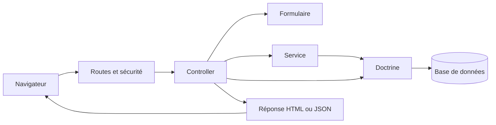

# Architecture technique

## 1. Vue d'ensemble

### Rôle de l’application

Le projet est le site de Radio Zinzine. Il rassemble un catalogue d’émissions, des contenus éditoriaux et une administration permettant de préparer la grille de programmation.

Le public consulte émissions, catégories, annonces, événements et programme. L’administration permet de gérer ces contenus, les médias, les comptes et les affectations de la grille.

### Stack principale

- **Symfony 7.1 et PHP >= 8.2** ; PHP 8.3 dans les images Docker.
- **Doctrine ORM et MySQL 8** pour la persistance décrite par les recettes Docker.
- **Twig, Stimulus et Turbo** pour les pages et leurs interactions.
- **Webpack Encore**, **VichUploader** et **PHPUnit** pour les assets, uploads et tests.

> Note — Le verrou Composer examiné contient FrameworkBundle 7.1.2, Doctrine ORM 3.2.1, DBAL 4.0.4 et Twig 3.14.0. Ces versions décrivent le dépôt, pas nécessairement le serveur déployé.

### Architecture générale

L’application est un **monolithe Symfony à rendu serveur**. Twig produit les pages HTML, JavaScript les enrichit et quelques endpoints JSON servent l’API et les interactions de l’administration.

Les contrôleurs coordonnent les requêtes. Les services portent les traitements complexes et les repositories organisent l’accès aux données. Les contrôleurs utilisent aussi directement Doctrine pour certaines opérations simples.

> Note — La racine Symfony est le sous-dossier [sitezinzine/](../sitezinzine/), distinct de la racine Git. Les chemins courts sont relatifs à cette racine Symfony. Cette documentation reprend les observations du 11 septembre 2026, sans nouvelle analyse complète.

## 2. Organisation Symfony

### Points de repère

Le code est dans `src/`, la configuration dans `config/`, les vues dans `templates/` et les ressources frontend dans `assets/`. `public/` contient le point d’entrée HTTP et les fichiers accessibles au navigateur.

`src/Kernel.php` définit le noyau. `config/routes.yaml` charge les routes déclarées par attributs. `config/services.yaml` active l’injection automatique et l’autoconfiguration, en excluant notamment les entités.

`migrations/` décrit les évolutions du schéma. `var/` contient notamment cache et logs ; il ne définit pas l’architecture applicative.

### Controllers : recevoir et coordonner

`src/Controller/` contient les parcours publics et les accès aux comptes. `Admin/` regroupe les outils de gestion, et `API/` les actions JSON du catalogue.

Un contrôleur choisit le formulaire ou le service adapté, traite le résultat et renvoie une page, une redirection ou du JSON. La grille demande davantage d’orchestration que les écrans de gestion classiques.

### Services : réaliser les traitements

`src/Service/` porte les calculs de programmation, les affectations, la publication, le traitement des MP3 et les intégrations externes.

Les règles métier ne sont pas toutes regroupées dans les services : certaines restent dans les contrôleurs, formulaires, entités ou requêtes. Comprendre une opération demande de suivre son parcours entre ces couches.

### Repositories : lire et sélectionner

`src/Repository/` centralise recherches, tris, filtres de visibilité et pagination Knp. Les méthodes retournent des entités, des QueryBuilders, des paginations ou des tableaux adaptés aux vues.

Les filtres sont importants : toutes les méthodes ne sélectionnent pas les mêmes statuts de publication ou de suppression.

### Entities : représenter les données

`src/Entity/` décrit les données persistantes et leurs relations avec des attributs Doctrine. Les entités portent aussi des contraintes de validation ; certains setters de la grille contrôlent directement leurs invariantes.

Une émission représente un contenu audio. Une diffusion représente un passage daté de ce contenu : leurs responsabilités sont distinctes.

### Forms : organiser la saisie

`src/Form/` définit champs, choix, relations et options. Les contraintes Validator complètent les contrôles de saisie.

Des options comme `show_valid` ou `with_mp3` adaptent un formulaire au parcours. Des listeners synchronisent les participants, normalisent les types personnalisés ou adaptent les champs de programmation.

> Attention — Une écriture directe par un service ne passe pas automatiquement par les règles d’un FormType.

### Twig / Stimulus : afficher et interagir

Twig assemble les vues publiques, l’administration et les fragments partagés. Le layout place le lecteur audio dans un élément `data-turbo-permanent`, destiné à le préserver pendant les navigations Turbo.

Stimulus gère formulaires interactifs, Flatpickr, TinyMCE, carrousels et grille. Le contrôleur de grille délègue les appels HTTP, glisser-déposer et affichages aux modules de `assets/controllers/grid/`. Le serveur reste responsable des écritures.

Le composant UX LiveComponent `related_emissions` assure filtrage thématique et pagination côté serveur. Une extension Twig fournit le surlignage des recherches. Des styles et scripts sont aussi présents dans les templates.

## 3. Flux général d'une requête

### Traitement côté serveur

Symfony associe l’URL à une action et applique les contrôles de sécurité du parcours. Le contrôleur consulte les données ou traite un formulaire soumis.

Pour un traitement complexe, il appelle un service. Celui-ci peut utiliser Doctrine, agir sur des fichiers ou contacter un service externe.

### Retour au navigateur

Une lecture renvoie généralement une vue Twig. Après une modification valide, les écrans classiques redirigent avec un message flash ; les interactions de grille peuvent recevoir du JSON.

La persistance passe par `persist`, `remove` et `flush`. Certaines opérations, notamment la publication de grille, regroupent leurs écritures dans une transaction.

## 4. Modèle de données

### Grandes familles

- **Catalogue audio** : émissions, catégories, thèmes, éditeurs et participants.
- **Programmation** : règles, créneaux, arbitrages, brouillons et diffusions.
- **Contenus** : annonces, événements et pages.
- **Comptes** : utilisateurs, rôles et jetons de réinitialisation.

Un invité ou ancien animateur n’est pas nécessairement un compte utilisateur. La date éditoriale d’une émission ne remplace pas non plus les horaires de ses diffusions.

### Persistance

Doctrine utilise les mappings PHP des entités et une connexion configurée par `DATABASE_URL`. Les migrations décrivent les évolutions attendues de la base.

> Attention — Suppression logique, annulation et suppression physique coexistent. Il faut vérifier l’entité et la requête concernées.

Voir [03 — Base de données](03-base-de-donnees.md) pour les relations, index, particularités des requêtes et accès DBAL.

## 5. Grille de programmation

### Les quatre objets à distinguer

| Objet | Responsabilité |
| --- | --- |
| `ProgrammationRule` | Regroupe une programmation récurrente pour une catégorie |
| `ProgrammationRuleSlot` | Définit un créneau : jour, heure, durée et récurrence |
| `DiffusionDraft` | Affecte une émission à un horaire concret pendant la préparation |
| `Diffusion` | Enregistre un passage concret, publié ou dépublié |

### Préparer la grille

Les services calculent les occurrences, appliquent les annulations ou déplacements, détectent les conflits et enrichissent la grille avec les affectations existantes.

L’administration permet de choisir des émissions, gérer des passages manuels et créer des fiches de direct à finaliser. Les premières diffusions et rediffusions associées peuvent partager un groupe d’affectation.

La semaine radio commence le mardi. Les récurrences, arbitrages et rediffusions sont détaillés dans [06 — Grille de programmation](06-grille-programmation.md).

### Publier une semaine

La publication reprend les affectations préparées pour créer ou mettre à jour des diffusions publiées. Les drafts restent liés aux diffusions correspondantes.

La dépublication rend les drafts éditables et conserve les diffusions en base avec un statut dépublié. Elle exige les liens nécessaires pour restaurer le travail de préparation.

> Note — Le mode « semaine validée » est déduit de la présence de diffusions publiées. Il ne correspond pas à une entité dédiée et ne garantit pas que tous les créneaux sont remplis.

Voir [07 — Publication de la grille](07-publication-grille.md) pour le cycle complet et les cas historiques.

## 6. Médias et MP3

### Stockage local

Les images et MP3 sont stockés sous `public/uploads/`. Doctrine conserve leurs noms ou chemins ; VichUploader relie les fichiers aux entités.

Images de contenu, images de pages, couvertures et fichiers TinyMCE ont des destinations distinctes. Les uploads TinyMCE passent par des actions dédiées.

### Traitement audio

Lors de l’édition d’une émission, le fichier téléversé est enregistré, puis traité par `Mp3Processor`. Le service écrit les tags ID3, choisit une couverture, range le fichier par catégorie et année, puis met à jour son chemin et son URL.

> Attention — SQL et fichiers ne partagent pas une transaction atomique. Les uploads doivent également être conservés lors des déploiements.

Voir [10 — Fichiers, MP3 et médias](10-fichiers-mp3-medias.md) pour le nommage, les tags, la suppression et les limites du traitement.

## 7. Sécurité

### Authentification

La connexion utilise le formulaire Symfony et un fournisseur Doctrine basé sur `User.username`. Le mot de passe est haché, le login possède une protection CSRF et le logout invalide la session.

L’application comprend confirmation d’adresse email, changement d’adresse avec une valeur en attente et réinitialisation du mot de passe par lien temporaire.

### Rôles

La hiérarchie va de `ROLE_USER` à `ROLE_EDITOR`, puis `ROLE_ADMIN` et `ROLE_SUPER_ADMIN`. Chaque niveau supérieur hérite du précédent. L’impersonation est activée pour le rôle autorisé.

L’accès global à `/admin` exige `ROLE_USER`. Des contrôles au niveau des actions peuvent imposer des permissions supplémentaires.

> Attention — Autorisations et protections CSRF se vérifient par parcours. Le statut « email vérifié » ne signifie pas que le firewall interdit globalement la connexion aux comptes non vérifiés.

Voir [04 — Authentification et rôles](04-authentification-roles.md).

## 8. Exécution et déploiement

### Docker

La recette de développement associe PHP/Apache, MySQL 8 et phpMyAdmin. Le code est monté dans le conteneur ; la base dispose d’un volume et les uploads sont montés séparément.

L’image de production est construite en plusieurs étapes : installation Composer, compilation frontend avec Node/Yarn, puis assemblage dans PHP/Apache.

### Assets et livraison

Le layout principal charge les fichiers compilés par **Webpack Encore** depuis `public/build/`. Le build sépare les chunks, active le versionnement en production et copie les ressources TinyMCE.

GitHub Actions construit et publie une image dans GHCR sur les tags de version. Le workflow présent ne décrit pas son déploiement sur un serveur.

### Intégrations et tâches

Le site lit un flux RSS mis en cache et un endpoint LibreTime destiné à un affichage de test. Une commande nettoie les anciennes annonces. Les messages email et notification sont routés de façon synchrone dans Messenger.

Les variantes Compose, le démarrage et les dépendances externes sont regroupés dans [12 — Déploiement](12-deploiement.md).

## 9. Tests

Les suites PHPUnit couvrent services, entités, formulaires, sécurité et contrôleurs. Elles combinent tests isolés et tests passant par le noyau Symfony et la base.

Un test d’action avec des doubles ne vérifie pas à lui seul tout le parcours HTTP. Voir [11 — Tests](11-tests.md) pour les repères et le suivi existant.

## 10. Points techniques à connaître

### Publication et affichage public

> Limite — `PublicScheduleBuilder` utilise `DiffusionRepository::findByWeek()`, qui ne filtre pas le statut de publication. D’autres requêtes le filtrent. Une dépublication ne garantit donc pas le masquage dans toutes les vues publiques.

### API partielle

> Limite — Dans la version examinée, la création d’émission de l’API se termine par `dd()` et `lastEmissions()` appelle une méthode absente du repository. Le normaliseur JSON produit `items`, `total`, `page` et `lastPage`, mais traite spécifiquement des émissions.

### Configurations frontend coexistantes

> Note — AssetMapper et `importmap.php` sont présents, mais le layout principal utilise Encore. Le bootstrap Stimulus utilise `require.context` de Webpack ; npm et importmap déclarent des versions Turbo différentes. Flatpickr, Glide et des polices sont aussi chargés depuis des services externes.

### Environnement réellement déployé

> Attention — Les variantes Compose diffèrent par leurs chemins et volumes. Les migrations sont commentées dans l’entrypoint. Configuration effective, migrations appliquées et sauvegardes restent à vérifier sur l’environnement concerné.

### Exploitation radio

> Limite — Aucun transfert automatique de grille ou de MP3 vers LibreTime n’est visible dans les services examinés. Le code ne confirme pas les tâches planifiées, la disponibilité des services externes ni les procédures éditoriales de l’équipe.

La racine Git contient aussi un petit projet Composer et un `src/Twig/HighlightExtension.php` extérieur à l’application. L’autoload `App\` de Symfony pointe vers son propre `src/` : ces fichiers extérieurs ne doivent pas être confondus avec le code chargé par l’application.
