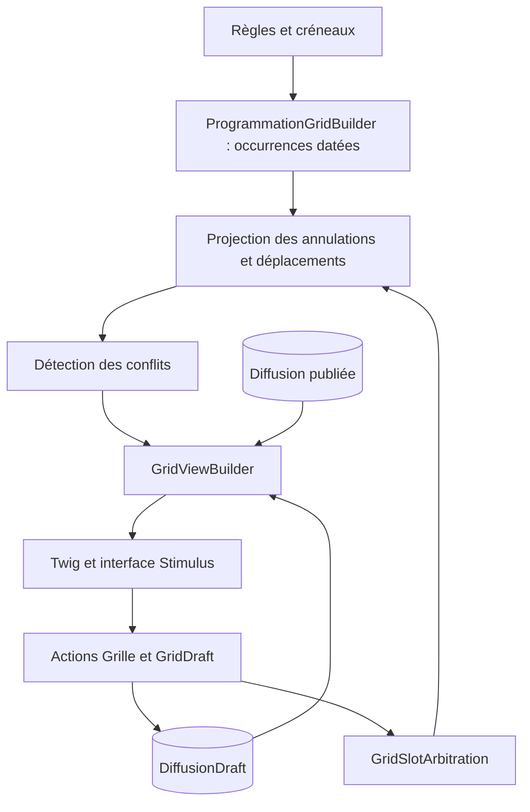

# Grille de programmation

> Note — Détails transférés depuis la vue d’ensemble, à partir de la lecture du dépôt du 11 septembre 2026. Les chemins sont relatifs à la racine Symfony sitezinzine/. Cette page ne constitue pas une nouvelle analyse exhaustive du sujet.

[Retour à l’architecture](01-architecture.md)

## Grille : règles métier explicitement codées

- La semaine radio va du mardi à 00:00 au mardi suivant exclu ; le lundi appartient à la semaine commencée six jours auparavant.
- Une règle appartient à une catégorie et peut avoir une fenêtre de validité. Ses créneaux portent jour, heure, durée et rang de passage.
- La récurrence peut être hebdomadaire, éventuellement paire/impaire, ou mensuelle selon une occurrence du jour : première à quatrième, ou dernière. Un intervalle de mois et un décalage de semaines complètent le modèle.
- La parité hebdomadaire utilise le numéro ISO de semaine du mardi de départ.
- L’affectation régulière part du rang 1 et génère les passages associés ; des opérations manuelles existent séparément.
- Dépublication et nouvelle publication réutilisent les liens historiques lorsque c’est possible, plutôt que supprimer systématiquement les diffusions.

Ces règles décrivent les calculs présents. Elles ne démontrent pas les pratiques de l’équipe radio, les critères éditoriaux de validation ni une synchronisation avec le matériel de diffusion.

### Trois représentations distinctes

| Représentation | Rôle technique |
| --- | --- |
| `ProgrammationRule` et ses `ProgrammationRuleSlot` | Définition récurrente rattachée à une catégorie ; pas une diffusion datée d’une émission choisie |
| `DiffusionDraft` | Affectation éditable d’une émission à un horaire concret, avec créneau facultatif, durée, fin, rang et groupe d’affectation |
| `Diffusion` | Passage concret enregistré, publié ou dépublié, lié à une émission |

`DiffusionDraft` possède les statuts `draft`, `published`, `cancelled`, un `deletedAt` et un lien facultatif `publishedDiffusion`. Ses types distinguent régulier, rediffusion manuelle, spécial manuel et direct manuel. `Diffusion` possède les statuts `published` et `unpublished` ; son statut initial est `published`.

Les deux objets peuvent conserver durée programmée, fin et `assignmentGroupKey`. Ce groupe relie les passages issus d’une même affectation ; le rang 1 représente la première diffusion, les rangs suivants ses rediffusions. La durée programmée peut différer de celle de la fiche émission.

### Construction et édition

`ProgrammationGridBuilder` calcule les occurrences visibles à partir des créneaux actifs. `GridOccurrenceProjectionService` applique les exceptions enregistrées pour une occurrence, y compris des déplacements entre semaines. `GridConflictDetector` analyse les chevauchements. `GridViewBuilder` enrichit les segments avec les données concrètes et les éléments manuels.

Le mode de grille est déterminé par l’existence de diffusions **publiées** sur la semaine, via `hasDiffusionsBetween`. Il n’existe pas d’entité « semaine validée » dans ce modèle : le mode est déduit des lignes présentes. Cela ne prouve pas que tous les créneaux de la semaine sont remplis.

Les contrôleurs `GrilleController` et `GridDraftController` orchestrent les affectations, suppressions et déplacements. `GridAssignmentService` affecte à partir du premier passage et crée/met à jour les drafts des créneaux associés actifs. `LiveEmissionCreator` peut créer une fiche d’émission de direct, marquée comme générée automatiquement et à finaliser, avant de l’affecter.

`GridRebroadcastCoverageService` compare les rediffusions attendues aux sources disponibles et distingue notamment couverture normale, remplacement, absence, arbitrage et source ambiguë. Il ne faut pas confondre cette vérification avec la seule détection géométrique de chevauchement. Les impressions de grille et d’annonces hebdomadaires ont leurs propres chemins de préparation.

