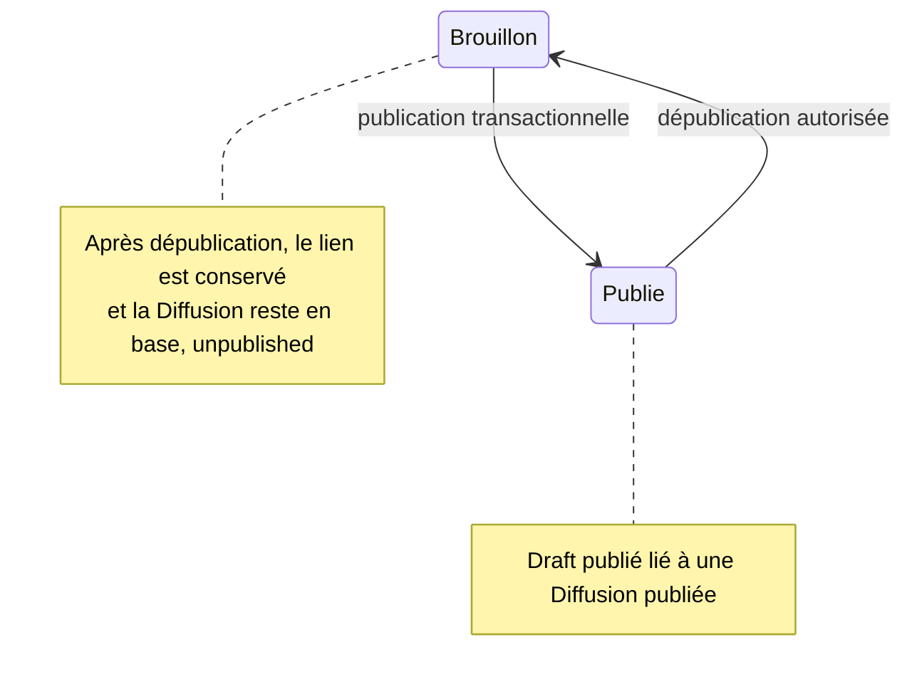

# Publication et dépublication de la grille

> Note — Détails transférés depuis l’architecture, sur la base du dépôt examiné le 11 septembre 2026.

[Retour à l’architecture](01-architecture.md)

La prévisualisation de publication inspecte les drafts publiables et les diffusions existantes. Elle calcule créations, mises à jour, conflits et drafts futurs des mêmes groupes. `publishWeek()` recalcule cette prévisualisation dans sa transaction et refuse une publication bloquée ou sans draft publiable.

Le draft est la source des données à publier. Une diffusion déjà liée est mise à jour. À défaut, une ancienne diffusion non revendiquée au même horaire peut être réutilisée ; sinon une nouvelle est créée. Le service copie émission, horaire, durée/fin, rang et groupe, publie la diffusion et marque le draft comme publié avec son lien. Il ne s’agit pas d’un déplacement destructif entre deux tables.

La dépublication exige au moins une diffusion publiée et un draft lié pour chacune. Une semaine historique sans ces liens est explicitement refusée. Le service passe les diffusions à `unpublished`, rétablit les drafts à `draft` et efface leur date de publication, en conservant les liens pour une prochaine publication.

**Limite visible du chemin public :** `PublicScheduleBuilder` appelle `DiffusionRepository::findByWeek()`, dont la requête ne filtre pas `publicationStatus`. Il n’est donc pas exact de décrire tout le programme public comme lisant exclusivement les diffusions publiées. D’autres méthodes, comme `findPublishedByWeek()` et `findLatestByEmission()`, filtrent bien ce statut.